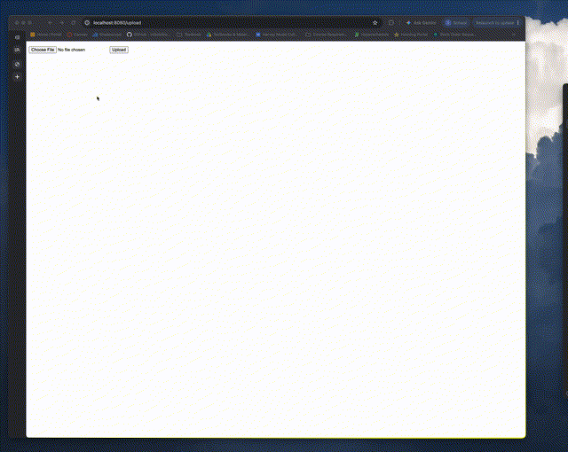

# flask-on-docker

[](https://github.com/seansu24/flask-on-docker/actions/workflows/ci.yml)

## Overview

A Flask web service running entirely in Docker, with a development stack and a production stack built from the same application code. The app returns JSON at its index route, serves static files, and lets you upload an image at `/upload` and view it back at `/media/<filename>`, with user records stored in PostgreSQL. In development, Compose runs the Flask development server with the source bind-mounted from the host, so code edits apply without a rebuild. In production, Compose swaps in a multi-stage image that lints with `flake8` and runs the app as a non-root user under Gunicorn, behind an Nginx reverse proxy that serves static and uploaded files directly.



## Build Instructions

You need Docker with Compose v2 and a free port `1146`.

**1. Clone the repo**

```bash
git clone https://github.com/seansu24/flask-on-docker.git
cd flask-on-docker
```

**2. Create `.env.dev`** — it holds the credentials and is not in version control:

```bash
cat > .env.dev <<'EOF'
FLASK_APP=project/__init__.py
FLASK_DEBUG=1
DATABASE_URL=postgresql://hello_flask:hello_flask@db:5432/hello_flask_dev
SQL_HOST=db
SQL_PORT=5432
DATABASE=postgres
APP_FOLDER=/usr/src/app
EOF
```

**3. Create the uploads folder** — Git does not track empty directories, so it is missing after a clone:

```bash
mkdir -p services/web/project/media
```

**4. Build and start**

```bash
docker compose up -d --build
```

This builds the app image, starts Postgres, and creates the database tables.

**5. Use it**

| URL | What it does |
| --- | --- |
| <http://localhost:1146/> | Returns `{"hello": "world"}` |
| <http://localhost:1146/static/hello.txt> | Serves a static file |
| <http://localhost:1146/upload> | Upload form — pick an image and submit |
| `http://localhost:1146/media/<filename>` | Shows the image you uploaded |

**6. Shut down**

```bash
docker compose down -v
```

### Useful commands

```bash
docker compose logs -f web    # follow application logs
docker compose exec web sh    # shell into the app container
docker compose ps             # list running containers
```

### Production stack

Stop the development stack first, since both use port `1146`:

```bash
docker compose down -v
docker compose -f docker-compose.prod.yaml up -d --build
docker compose -f docker-compose.prod.yaml exec web python manage.py create_db
```

This needs `.env.prod` and `.env.prod.db`, which follow the same pattern as `.env.dev`. The site is again at <http://localhost:1146>, this time served through Nginx and Gunicorn.

## Continuous Integration

[`.github/workflows/ci.yml`](.github/workflows/ci.yml) runs on every push and pull request to `main`. It builds the development stack, waits for the site to respond, uploads a test image, and fetches it back from `/media` to confirm the upload flow works. It also builds the production image, which runs `flake8`. The badge above is green only when all of that passes.

## Credits

Based on *Dockerizing Flask with Postgres, Gunicorn, and Nginx* by Michael Herman on [testdriven.io](https://testdriven.io/blog/dockerizing-flask-with-postgres-gunicorn-and-nginx/).
